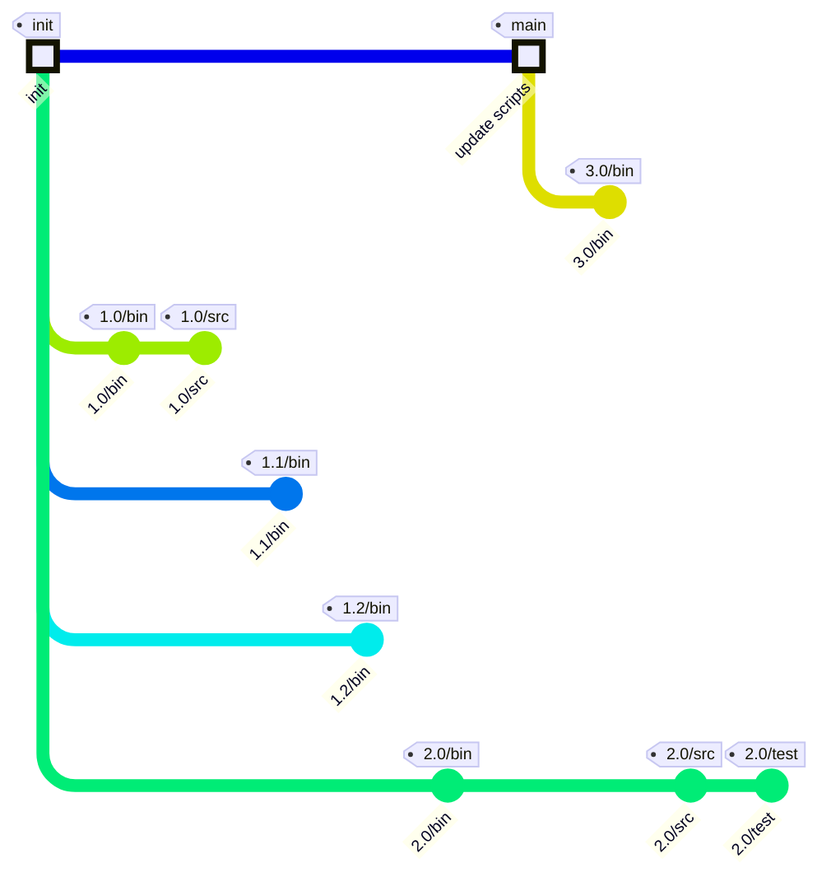

# git-artifact 🚀📦

> Effortless artifact management using Git repositories

## Key Benefits

- **Seamless integration:** Manage artifacts alongside your source code using familiar Git tools.
- **Efficient storage:** Artifacts are stored as independent commits, so you fetch only what you need.
- **Traceability & integrity:** Tags and Git’s checksums provide clear versioning and authenticity.
- **Easy cleanup:** Remove intermediate artifacts by simply deleting their tags.
- **Unified workflow:** Eliminate the need for separate artifact repositories or complex tools.

Whether for embedded, enterprise, or CI/CD environments, `git-artifact` streamlines artifact management by making it a natural extension of your existing Git processes.

## Quick Start

```bash
# 1. Install git-artifact binary in your PATH
curl -o ~/.local/bin/git-artifact https://raw.githubusercontent.com/praqma/git-artifact/main/git-artifact && chmod +x ~/.local/bin/git-artifact

# 2. Create a new repository on GitHub (open this URL in your browser)
open https://github.com/new?name=test-git-artifact

echo "Press Enter after creating the repository..." && read

# 3. Initialize the repository locally (replace _USER_ with your GitHub username)
git artifact init --url=git@github.com:_USER_/test-git-artifact.git --path test-git-artifact && cd test-git-artifact

# 4. Add an artifact
touch artifact-1.0
git artifact add-n-push -t v1.0

# 5. Find and retrieve the latest artifact
git artifact find-latest
git artifact fetch-co-latest
```

No external tools or complex configurations are needed. `git-artifact` leverages Git's powerful version control features to manage artifacts as if they were part of your source code.

## How to use `git-artifact`

### Install git-artifact

To install `git-artifact`, simply download or clone this repository and ensure the script is available in your `PATH`. Once in your `PATH`, `git` will automatically recognize `git-artifact` as a native subcommand (`git artifact`), seamlessly extending your Git functionality.

Or quickly install `git-artifact` by running:

```bash
mkdir -p ~/.local/bin && curl -o ~/.local/bin/git-artifact https://raw.githubusercontent.com/praqma/git-artifact/main/git-artifact && chmod +x ~/.local/bin/git-artifact
```

Make sure `~/.local/bin` is included in your `PATH` environment variable:

```bash
# For bash users
echo 'export PATH="$HOME/.local/bin:$PATH"' >> ~/.bashrc && source ~/.bashrc
```

```zsh
# For zsh users
echo 'export PATH="$HOME/.local/bin:$PATH"' >> ~/.zshrc && source ~/.zshrc
```

```bash
# Verify installation
git artifact -h
# Note: Use -h instead of --help (--help looks for a man page which isn't installed)
```

Now you can use `git artifact` as a regular Git command.

### Create a test repository

- Create a repo, for example on GitHub: [https://github.com/new?name=test-git-artifact]

- Use the `git artifact init` command to initialize a new repository locally for managing artifacts.

```bash
# replace `_USER_` with your GitHub username
git artifact init --url=git@github.com:_USER_/test-git-artifact.git --path test-git-artifact
```

### Add the artifact

Copy the artifacts to your path in the folder structure the "consumer" desires. There is no reason to tar or zip it. Git will handle this for optimized storage and ease of use.

```bash
cd test-git-artifact
touch artifact-1.0
# cp -rf <build-dir>/my.lib /include .
git artifact add-n-push -t v1.0
```

Voila! The artifact v1.0 is now committed, pushed _and_ importantly - the workspace is set back to the default branch of the remote repository. It is now ready to make a new artifact based on the default branch.

### Finding and getting artifacts

```bash
# You can use the `git artifact clone` command to clone a repository and set it up for artifact management. Note that you only clone and get the default branch!
git artifact clone --url=git@github.com:_USER_/test-git-artifact.git --path test-git-artifact
cd test-git-artifact
```

```bash
# Find the latest using pattern
git artifact find-latest -r 'v*.*'
```

```bash
# Download and checkout the latest
git artifact fetch-co-latest --regex 'v*.*'
```

## Notes

### Permissions needed

`git-artifact` relies on Git tags for artifact management. As a producer, you need permission to create and push tags to the remote repository. To effectively manage and clean up old artifacts, having permission to delete tags is also recommended.

Alternatively, `git-artifact` can operate in branch mode, maintaining a `latest` branch to track the most recent artifact. This requires force-push or delete-and-push rights for the branch. The approach is similar to Docker’s `<image>:latest` tag and is useful if you want to use tracking branches outside of `git-artifact`—for example, with Git submodules or repo manifests.

### Producer of artifacts

A few remarks, aspects and thoughts when storing artifacts:

- Easy to append artifacts as stages evolve with more artifacts
- No need to zip before upload - just commit as the artifact should be used
- Easy to add information, environment, tools and git source sha1 in the artifact for traceability and later reproduction
- Add the source code as a dependency to the artifact. It will then be easy to restore the source for diff and debugging

### Consumer of the artifacts

A few remarks, aspects and thoughts when retrieving artifacts:

- The consumer does not need anything other than standard git
- Pipelines just consume the artifact unzipped and ready to use as they were produced
- Use your favorite git dependency system like submodules (this is the correct way for submodule usage btw), repo tool or similar
- Even a consumer can be a producer by adding further artifacts on top of the consumed commit with a new commit and tag
- Git understands the content in workspace and git clean does not remove artifacts in contrast to downloaded artifacts

### How is it done

Git normally stacks the history; hence you cannot delete commits in the middle of the history. `git-artifact` makes a "horizontal" history - i.e., the commits are not stacked on top of each other, but next to each other.

The history of the git-artifact workflow can basically look like this:



## Troubleshooting

### Common Issues

**`git artifact --help` shows "No manual entry for git-artifact"**

- Use `git artifact -h` instead
- The `--help` flag looks for a system man page which isn't installed with the script
- The `-h` flag shows the built-in help from the script itself

**Error: `git: 'artifact' is not a git command`**

- Ensure `git-artifact` is in your PATH: `which git-artifact`
- Verify the script is executable: `ls -la $(which git-artifact)`
- Try restarting your terminal or running `source ~/.bashrc` (or `~/.zshrc`)

#### Permission denied errors

- Check you have push access to the repository
- Verify SSH keys are configured: `ssh -T git@github.com`
- Ensure you have permission to create/push tags

## Advanced

### Appending to an artifact

You can append to an artifact advantageously. Let's say you create a library and you run a lot of tests at a later stage and the result is a test report. You can then just add that on top of the library tag.  

- Download and checkout the artifact ( see above )
- Add a new artifact ( see above )

You should of course consider this in your naming convention. Consider something like this:

```bash
vX.Y.Z/release-note
vX.Y.Z/test
vX.Y.Z/src
vX.Y.Z/lib
```

#### Add the source code that was used to build the artifact

The source code in many companies and open-source projects is free to view, debug and edit. You can make it easily accessible by adding the source code as a submodule and sha1 into the artifact history. It sounds odd, but it gives developers easy access to checkout the correct version that was used to build the artifact.

This way it is actually possible to create a full blockchain of everything that was involved in producing a product.

### LFS

`git artifact` works great out of the box without any extensions like LFS. It can though still be interesting to commit a `git-lfs` configuration to the default branch

- Artifact sets that contain many common binary/large files from version to version will then be able to detect that they already have this file in the LFS storage and do not have to fetch/push it again.
- You can download all tags without checkout and then you can search for metadata in the annotated tags without suffering large data transfer and storage in order to clean up.

### Promotions

There are generally two default ways you can do promotions.
Building new artifacts for the release is like creating a new artifact using the above patterns, which can either be a new or appended artifact.

Promotion decisions should also be seen in connection to pruning of tags which are no longer valid or of any interest. It should be simple and easy to prune without fear of deleting tags that should not be deleted.

#### Using different repository

This way is like promotion in normal artifact management systems, where you promote from one project/repository to another. You basically download the tag from the original repository and then push the tag to the promotion repository. This way you can control access and keep different URLs for candidates and releases.

#### Using same repository

This way requires you to create a tag using a release tag pattern. The tag can either be a new unrelated tag or it can be appended on top of a release candidate tag.

### Add information to the annotated tag

TODO: option for file or string

### Pruning / cleaning artifacts

TODO: based on count..
